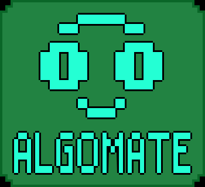

# 📚 Algomate

### *Learn Data Structures & Algorithms through Interactive Simulations*

---

# 📖 About

**Algomate** is an educational Android application developed as a thesis project to make **Data Structures and Algorithms (DSA)** more engaging and accessible.

Instead of relying solely on textbooks or lectures, Algomate allows students to learn through:

- 🎮 Interactive simulations
- 📚 Structured lessons
- 🧩 Gamified assessments
- 🏆 Rewards and achievements
- 👤 Unlockable pixel-art characters
- 🔊 Voice-assisted learning
- 💻 Code translation using the JDoodle Compiler API

The application aims to help students visualize complex DSA concepts while keeping learning enjoyable.

---

# ✨ Features

## 📚 Learning Modules
- Stack
- Queue
- Linked List
- Trees
- Graphs
- Linear Search
- Binary Search
- Interpolation Search
- Bubble Sort
- Selection Sort
- Insertion Sort
- Quick Sort
- Merge Sort

---

## 🎮 Interactive Simulations

Visualize algorithms step-by-step.

Students can watch elements move, compare values, and understand how each algorithm works in real time.

---

## 📝 Assessments

- 🎯 Three difficulty levels
    - Easy
    - Medium
    - Hard
- 💰 Earn SCS Coins after completing assessments

---

## 🛒 Shop System

Spend earned coins to unlock:

- 👤 Pixel-art profile pictures
- 🔊 Unique Text-to-Speech voices

---

## 📈 Progress Tracking

- Lesson completion
- Assessment scores
- Difficulty progress
- Coin balance
- Statistics dashboard

---

## 🔊 Voice Narration

Each profile picture comes with its own Text-to-Speech voice, creating a personalized learning experience.

---

## 💻 Code Translation

Translate algorithms into multiple programming languages using the **JDoodle Compiler API**.

Supported languages include:

- Python
- C
- C++
- Java

---

# 🛠️ Built With

| Technology | Purpose |
|------------|---------|
| 🎮 Godot Engine | Application Development |
| 🐍 GDScript | Programming Language |
| 🗄 SQLite | Local Database |
| 🌐 JDoodle API | Code Translation |
| 🎨 Aseprite | Pixel Art Assets |
| 🔊 Godot TTS | Voice Narration |

---

# 🎯 Objectives

- Improve DSA comprehension
- Increase student engagement
- Encourage self-paced learning
- Provide interactive algorithm visualization
- Support beginner programmers

---

# 👨‍💻 Developers

**Capstone Project**

<table>
<tr>
<td width="180" align="center">
  
<b>Jezreel Villanueva</b>
</td>
<td>

- Project Leader
- Full-Stack Developer
- Database Design
- Planning
- Documentation
- Tester
- Asset Designer

</td>
</tr>

<tr>
<td width="180" align="center">
  
<b>Ryan Dumali</b>
</td>
<td>

- Programmer (Modules)

</td>
</tr>

<tr>
<td width="180" align="center">
  
<b>John Lawrence Rivera</b>
</td>
<td>

- Programmer (Modules)

</td>
</tr>

<tr>
<td width="180" align="center">
  
<b>Ace York Buban</b>
</td>
<td>

- Programmer (Menu)
- UI/UX Design

</td>
</tr>

<tr>
<td width="180" align="center">
  
<b>Janeil</b>
</td>
<td>

- Documentation

</td>
</tr>
</table>

---

# 📄 License

This project was developed for academic purposes.

---

# ⭐ Future Improvements

- ☁ Cloud synchronization
- 🏅 Leaderboards
- 🤝 Multiplayer challenges
- 🌙 Dark mode
- 📊 More analytics
- 🌍 Additional programming languages
- Consolidation of Simulations

---

### ⭐ If you found this project interesting, consider giving it a star!

Made with ❤️ using Godot Engine

